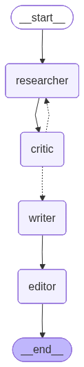

# Research & Brief Generator (Multi-Agent Orchestration)

Live demo: https://research-brief-agents-9saglp7dsgudsthnnvcxdh.streamlit.app
(first brief is free, no signup needed)

A multi-agent system built with LangGraph. Give it a topic and four agents
work together to produce a structured brief, with a feedback loop between
the research and review steps.

## What it does

Give it a topic. Four agents collaborate to produce the brief:

1. Researcher - searches the web and digests findings into notes
2. Critic - reviews the notes and decides if they're thorough enough
3. Writer - turns approved research into a structured draft
4. Editor - polishes the draft for tone, clarity, and flow

If the Critic isn't satisfied, it sends feedback back to the Researcher
for another pass (capped at 3 loops). The control flow is decided at
runtime based on state rather than hardcoded as a straight line.



```
researcher -> critic -> [approved?] -> writer -> editor -> end
                |
                +-- [not approved] -> back to researcher
```

The routing logic lives in `graph/build.py`.

## Setup

```bash
python -m venv venv
source venv/bin/activate   # Windows: venv\Scripts\activate
pip install -r requirements.txt
cp .env.example .env        # then fill in your API keys
```

You'll need:
- An Anthropic API key ([console.anthropic.com](https://console.anthropic.com))
- A Tavily API key ([tavily.com](https://tavily.com), free tier is enough)

## Usage

```bash
python main.py "the impact of agent orchestration on small business AI adoption"
```

Each agent prints what it's doing, so the research -> critique ->
(maybe loop) -> write -> edit flow is visible in the terminal.

## Project structure

```
agents/
  researcher.py   - searches and digests web findings
  critic.py       - reviews research, decides approve/retry
  writer.py       - synthesizes approved research into a brief
  editor.py       - polishes the final brief
graph/
  state.py        - shared state schema all agents read/write
  build.py        - graph wiring + routing logic
utils/
  llm.py          - Claude client config
  search.py       - Tavily search wrapper
main.py           - CLI entry point
app.py            - Streamlit web UI
visualize.py      - renders the graph to graph.mmd / graph.png
```

## Visualize the graph

```bash
python visualize.py
```

Writes `graph.mmd` (Mermaid source) and `graph.png` (rendered via the
mermaid.ink API, needs internet). Offline, paste `graph.mmd` into
[mermaid.live](https://mermaid.live).

## Tracing with LangSmith

To inspect the exact prompt and response for every node, enable LangSmith
tracing through environment variables (no code changes):

1. Get an API key at [smith.langchain.com](https://smith.langchain.com)
2. In your `.env`, set:
   ```
   LANGCHAIN_TRACING_V2=true
   LANGCHAIN_API_KEY=your_key_here
   LANGCHAIN_PROJECT=research-brief-agents
   ```
3. Run as normal. Each run shows up as a trace tree, one span per node,
   with the full prompt and response inside each.

## Web app

A Streamlit UI so it can be used from a browser.

```bash
streamlit run app.py
```

Deploy on Streamlit Community Cloud:

1. Push this repo to GitHub.
2. Go to [share.streamlit.io](https://share.streamlit.io), sign in with
   GitHub, and point it at this repo with `app.py` as the entry file.

### Free-trial keys (optional)

The app supports a "one free brief, then bring your own keys" flow. To
enable it, add your keys as Streamlit secrets (never commit them):

- Local: create `.streamlit/secrets.toml`:
  ```toml
  ANTHROPIC_API_KEY = "sk-ant-..."
  TAVILY_API_KEY = "tvly-..."
  ```
- Streamlit Cloud: app -> Settings -> Secrets -> paste the same two lines.

With secrets set, each visitor gets one free brief on your keys, then is
asked to paste their own. With no secrets, every user pastes their own
keys from the start. The free-run limit is per browser session, so set a
spend cap in the Anthropic console if you expose this widely.

## License

MIT - see [LICENSE](LICENSE).
